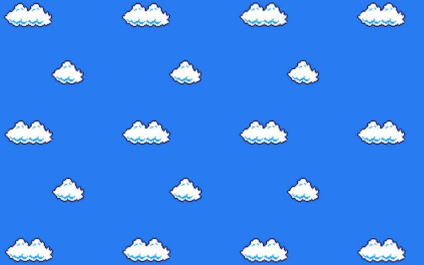
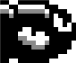
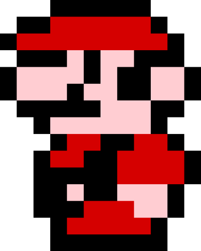

# A Day in Bill's Life

#### Video Demo: 
WIP <URL HERE>

#### Description:
A Day in Bill's Life is a side scrolling video game written in Lua with the LÖVE framework in which you play as "Bullet Bill". It's just another regular day in Bill's life where you are entasked by "Bowser" to defeat "Mario". To do so, you must collect coins to go faster and avoid crashing into any "Goombas" that will reduce your speed. Things start off manageable, but soon become hectic as you start speeding through the skies.

#### Files:
##### main.lua:
This file contains all of the logic that dictates the flow of the game. It consists of the required 3 functions of the LÖVE framework to run a game: love.load(), love.update(), and love.draw(). Within these 3 functions is code that you would expect to see after playing the game, such as spawning and despawning of coins and "Goombas", the ability to see your player speed and number of collected coins increase, and the ending sequence of crashing into "Mario". There are also some other  more "under the hood" features, such as the logic of when sound effects play, the logic that determines when the ending sequence plays, and the logic that keeps track of how many coins and "Goombas" you have collected and crashed into.

In addition, there are some supplementary functions at the bottom, including the resetGameState() function that allows the user to replay the game by resetting all of the file's variables to the starting values located in love.load().

##### classic.lua:
This is a library file that allows classes to be created. It can be found [here](https://github.com/rxi/classic) and is used in [Sheepolution's guide to LÖVE on classes](https://sheepolution.com/learn/book/11).

##### entity.lua:
This file draws on class.lua to allow entities to be created in the game. The original file can be found on [another chapter in Sheepolution's guide to LÖVE](https://sheepolution.com/learn/book/23). I have modified it to include the speed property.

##### coin.lua, background.lua, and mario.lua:
These files are pretty barebones. They exist just to create their respective entities that inherit the properties that exist in entity.lua, as well as stating the paths to their respective images.

background.lua is notable because although there is no direct interaction between the player and the background, the file is required to make the background infinitely scroll.

##### goomba.lua:
This file stands out a bit more as it contains a rotation property, which is used so that the "Goombas" can rotate and rotate faster as the game progresses.

##### player.lua:
Because the player is controllable, this file also contains more code. The player actually has a speed that is independent from all other entities and thus the speed that is displayed in game (sorry to break the illusion). The player's color and opacity changes throughout the game, hence why the draw function is different from the one in entity.lua. There is code that allows the player to move based on user input, as well as code that prevents the player from moving horizontally off-screen.

##### text.lua:
This file contains most of the static text shown in the game. This was mainly to accommodate the large paragraph on the title screen, but I just added in some of the other text because the file already existed.

##### conf.lua:
Changes the window title to the name of the game and the window icon to the player icon. Also turns on v-sync.

#### Design Choices on Noteworthy Elements:

##### Displayed Speed is a Lie?:
At first glance, the speed that is displayed in the top left of the game would appear to indicate the speed of the player. However, that is not the case as it actually displays the speed of the coins and "Goombas". The player has its own speed value that is not displayed. These 3 entities shared the same speed when I first started making this game, but after some play testing, I realized that the game would play better if the player was able to move faster than the coins and "Goombas". And of course, the background has its own speed because it wouldn't make sense to move as fast as everything in the foreground.

##### Taking Scrolling Backgrounds for Granted:
As is probably evident to most seasoned coding veterans, this is both my first project and first game. One things that most games have that I never really stopped to think about before are scrolling backgrounds. This game initially had a static background, but I decided to try implementing a scrolling background to contribute to the game's sense of speed. This was one of the harder features to nail down, especially since, now that I think about it, I might have forgotten to make thorough Google searches and made through multiple instances of trial and error. This is the rough timeline from start to finish:
  
- 1) Background images would be created in a table then drawn to the screen. Upon leaving the screen, the image would be deleted from the table and a new image would be added to the table.
- 2) Instead of removing the image from the table, the image's x-coordinate would instead be changed to be off-screen to the right at 2 times the width of the image, which was the starting point of the right most image. (due to the size of the image, there needed to be 2 rows and 3 columns of the image as a 2 dimensional array).
  - There was an issue where eventually some black vertical bars would appear as the game progressed. After searching online, I thought it was some v-sync issue but forcing v-sync to be own didn't fix that issue.
- 3) I put a bandage solution in place so that I could focus on making other features. This bandage solution was to just turn the background of the screen to be the same blue as the background image so that the vertical bars would not be noticeable.
  - There was also still an issue where the images would eventually overlap each other, but I just put that aside for the time being.
- 4) At this point, the images were not scrolling using delta time, which seems to be a best practice. I eventually changed the images to use delta time after getting one step closer to figuring the solution by just changing the order of the logic in which the images scrolled.
  - This actually wasn't the ultimate solution but it fixed something at the time (I think it was the overlap issue).
- 5) The actually solution was to set the x-coordinates of the images to be the x-coordinate + the width of the image of the rightmost image. The problem of the previous approach of just setting the x-coordinates to be the 2 times the width of the image is that this wouldn't perfectly line up with the middle image.
  
After all that, I was finally able to implement a smooth scrolling background. Despite the troubles, this was a good learning experience.
  
##### Breaking Down the Fade to Black:
Another common video game thing that most people experience but never really think about is the screen fading to black. In this game, the screen fades to black after "Mario" walks off-screen to the left, leading the player to see a results screen. LÖVE doesn't have its own inherent fade to black function under the love.graphics module. Looking online didn't lead to any concrete help (I actually did look for this feature), so I had to come up with my own solution. This required me to really break down what fading to black meant and what exactly was being shown on screen. I eventually realized that transparency played a role since you have to transition from a point where you can see everything on screen to a point where you just see black. One of my first thoughts was to create a separate class just for this feature, where I would be able to adjust some opacity property. I tried this approach but it didn't work, either because I messed up the implementation test or it just wasn't the right way to go about it.

After some experimenting, I decided to approach this problem by drawing black rectangles to the screen that would start of with 0 opacity (so completely transparent) then increasing the opacity with each new rectangle. This drew a slightly blacker rectangle until the screen was fully dark. The final color of the results screen was not completely black #000000. This is so that "Bullet Bill" is easier to see.
  
I incorporated my learnings from this feature into the feature where "Bullet Bill" fades away after crashing in to "Mario".
  
##### Moving Off-Screen:
During regular gameplay, the player is not able to move beyond the boundaries of the screen. The code that prevents this movement was originally located together in 2 if statements (1 for horizontal movement and 1 for vertical movement) in the player.lua file. However, after deciding on implementing the event sequence that takes place after crashing into "Mario" and having "Bullet Bill" fall down into its implied demise, I realized I had to move the if statement for horizontal movement to main.lua so that I could "turn it off" after the crash.
 
##### Large Text:
The large paragraph and some other strings of text are located in the text.lua file, away from main.lua. My initial plans were to have a large paragraph of text on the title screen and another paragraph on the results screen. The title screen paragraph exists, but I decided against a results screen paragraph due to there being a lack of room given the game stats. Since these 2 paragraphs would have taken up a ton of space in the IDE, I had decided to house text in text.lua.
  
##### Grammatically Correct:
No one would probably ever notice outside of looking at the code, but the game stats take into account the edge cases of collecting only 1 coin or avoiding only 1 "Goomba". I doubt anyone would be able to purposefully do so, but if they do, they'll see that the game stats follow subject-verb agreement.
  
##### Music & SFX:
It's no secret that this game is based on a certain famous Nintendo IP, but why are the images and sprites the only assets taken from other games? Why not go all the way and use the music and sound effects too?
  
The answer:
  
I just though it would be funny to make sound effects and find random free music to use.
  
##### Why is the story so sad? :(
  
I don't know, I just thought it would be funny.
  
# Credits
#### Here are a list of the assets used in this game:
##### Images

  
Modified version of this [art](https://www.deviantart.com/sadistmoi/art/Mario-Clouds-Desktop-127026235) by sadistmoi on DeviantArt.
  

  
Modified version of this [art](https://www.seekpng.com/ima/u2q8i1y3w7i1u2y3/) originally by Nintendo.
  

  
Modified version of this [art](https://www.softicons.com/game-icons/super-mario-icons-by-sandro-pereira/retro-coin-icon) originally by Nintendo.
  

  
Modified version of this [art](https://www.newgrounds.com/art/view/snipeshotofficial/super-mario-bros-3-goomba) by SnipeshotOfficial on Newgrounds, originally by Nintendo.
  

  
Modified version of this [art](https://www.pixilart.com/art/super-mario-bros-3-mario-sprite-992ef93085dd645) by HarrisonStrange on Pixilart, originally by Nintendo.
  
##### Music
[8 Bit Menu](https://www.fesliyanstudios.com/royalty-free-music/download/8-bit-menu/287) - by David Renda
  
Credit to https://www.FesliyanStudios.com for the background music.
  
This song plays on the title screen and regular gameplay.
  
[Game Over](https://patrickdearteaga.com/chiptune-8-bit-retro/) - by Patrick de Arteaga
  
This song plays on the results screen.
  
##### Sound Effects
  
The warp sound effect that plays when "Mario" continues about his day after being shot at was made using [ChipTone](https://sfbgames.itch.io/chiptone) by SFBGames.
  
All of the other sound effects were made using [Bfxr](https://www.bfxr.net/) by increpare.
